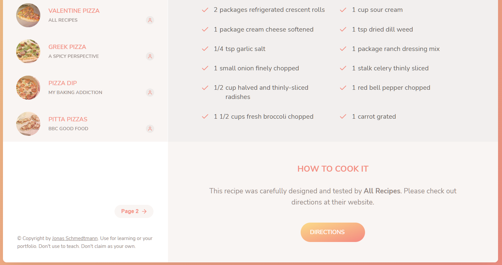

# JavaScript web application - "Forkify"

[Check out the live version](https://forkifyrecipesjw.netlify.app/)
> by [James Waters](https://james-waters.com)
# 
# 

## Motivation & Acknowledgements

This project was created while completing "The Complete JavaScript Course 2021: From Zero to Expert!" by Jonas Schmedtmann.

## Work Vs. Template Code

HTML elements and CSS styling were provided as a template file for this landing page. 
I added JavaScript to add dynamic and interactive content to the page such as a sticky nav bar, a tabbed component, and a slider component. I utilized the intersection observer API to add smooth transitions to each section. Performance considerations included lazy loading images and efficient script loading. 

## JavaScript concepts and techniques used

- Event Propagation: Bubbling and Capturing
- Interstion Observer API
- Lazy loading images
- Smooth scroll
- Building tabed and slider components

## Built With

- HTML
- CSS
- JavaScript
- VS Code
- Git

## Introduction

Forkify is a recipe web app using the Forkify API to allow users to search, view, modify, bookmark and add recipes.

### Features

* Query an ingredient to recieve a list of recipes containing that ingredient.
* Easily bookmark or edit the servings of the selected recipe.
* Create your own recipes and store them as user recipes.
* Remove bookmarks or delete user recipes.
* LocalStorage keeps the data when users exit the app.

### Project Architecture

Built using the MVC Architecture. View class extends the rest of the components. Controller keeps bidirectional dataflow. SCSS files are divided for major components.

