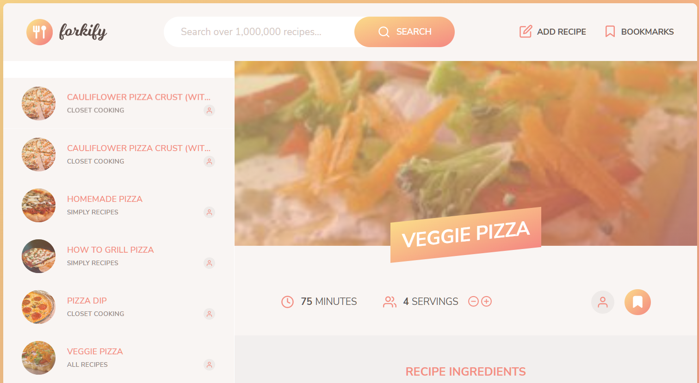

# JavaScript web application - "Forkify"

[Check out the live version](https://forkifyrecipesjw.netlify.app/)

## Overview
Forkify is a web application developed using JavaScript. The project is built using an MVC (Model View Controller) architecture pattern. It pulls data from an API to allow users to search recipes based on key words or ingredients. Users functionality includes the ability to update ingredient quantities based on your desired serving size as well as bookmarking your favourite recipes to save for later. The application is hosted and can be viewed live on Netlify.  

## Motivation & Acknowledgements
This project was created while completing "The Complete JavaScript Course 2021: From Zero to Expert!" by Jonas Schmedtmann. 
HTML and CSS styling for all elements of the application were provided as a template at the beginning of the project. 

| User Story     | Feature |
| ----------- | ----------- |
|   Search for recipes    | Input field to send request to API with searched keywords. Display results with pagination. Display recipe with cooking time, servings and ingredients      |
| Update the number of servings   | Update all ingredients according to current number of servings        |
| Bookmark recipes   | Display list of all bookmarked recipes        |
| See my bookmarks when I come back later   | Store bookmark data in the browser using local storage. On page load, read saved bookmarks from local storage and display        |

## Implemented Features
- **Search**: Users can search a key word or ingredient. The results controller queries the API and renders the results to the screen. 
- **Pagination**: Results are rendered using pagination. Each page renders 10 new recipes from the search results. 
- **Recipe View**: Displays additonal recipe information such as ingredients, an example image, and the link to the original recipe. 
- **Update servings**: Automatically updates the required quantites for each ingredient when serving size is adjusted by the user. 
- **Bookmarks**: Allow users to mark their favourite recipes. Bookmarked recipes can be viewed and accessed in the bookmarks dropdown. 

## JavaScript concepts and techniques used
- Event Propagation: Bubbling and Capturing
- Interstion Observer API
- Lazy loading images
- Smooth scroll
- Building tabed and slider components

### Features

* Query an ingredient to recieve a list of recipes containing that ingredient.
* Easily bookmark or edit the servings of the selected recipe.
* Create your own recipes and store them as user recipes.
* Remove bookmarks or delete user recipes.
* LocalStorage keeps the data when users exit the app.

### Project Architecture

Built using the MVC Architecture. View class extends the rest of the components. Controller keeps bidirectional dataflow. SCSS files are divided for major components.

## Author
[James Waters](https://james-waters.com)

